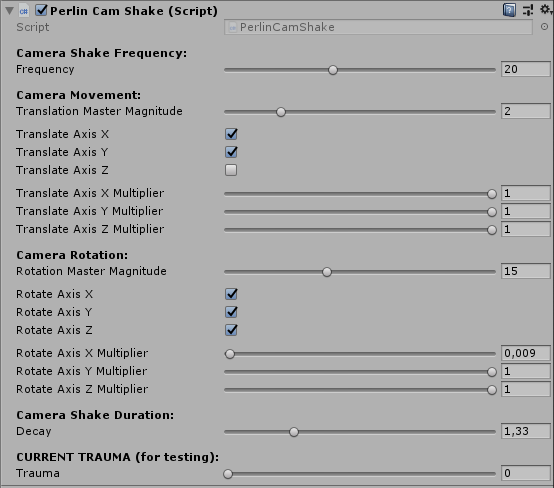

# Perlin Camera Shake component for Unity3D

Just a camera shake `MonoBehaviour` script that you can attach to a `Camera` as a component in Unity3D. I guess it can be ideal if you just need camera shake, and would rather not use the full Cinemachine package.

----
#### Version information: Tested in Unity 2018.3, requires scripting runtime set to '.Net 4.x equivalent' (uses C# 7 features)
----

## Main feature: It's not crappy code
- It doesn't do any polling. If you add 'trauma', it starts a coroutine that processes the trauma, and then exits.
- Doesn't keep 'lerping' indefinitely.
- Generally only executes what is strictly necessary for the given settings, e.g.:
  - If  you set only rotational shaking, it won't bother calculating translation.
  - If you only ask for X axis translation, it won't calculate things for the other axes.
  
Overall it should be performant. Not that it matters a lot probably, but still. ;)

## Prerequisites

- Your `Camera` should be parented to another `GameObject`, and that `GameObject` should be moved, if your game requires a moving camera. But this is how we normally use cameras in Unity. However, the script does support non-zero initial camera positions and rotations.

## Usage
- Copy the `.cs` file to your `Assets` folder.
- Add the component to your Camera.
- Set the settings in the Inspector pane, and test it by manually adding some trauma.

Obviously, you'll need to add 'trauma' during runtime to initiate the camera shake. You can do this by directly accessing the public `Trauma` property of the component. I used it with my own event system instead, but I commented out the event-related lines. Feel free to remove these if you're not gonna use any event system.

## Settings

You can customize the following parameters of the Perlin noise based camera shake in the Inspector:

## Bugs

Hopefully none. If you happen to find any, let me know, and I'll fix them.

## Licence

It appears that some people are using this component, so I added an explicit MIT licence for your peace of mind.

## Sources/inspirations

- The concept of 'trauma' as a 0-1 float, plus the usage of Perlin noise originates from this GDC talk:
  - [GDC16 - Math for Game Programmers: Juicing Your Cameras With Math](https://www.youtube.com/watch?v=tu-Qe66AvtY)
- The implementation is partially inspired by this video:
  - [Unity Camera Shake - A Realistic, Verstile Effect using Perlin Noise](https://www.youtube.com/watch?v=s3FS7AkiEnE)
